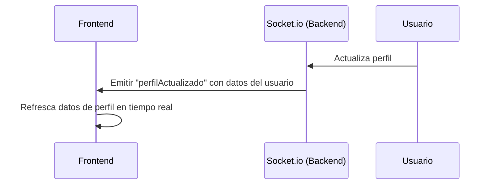
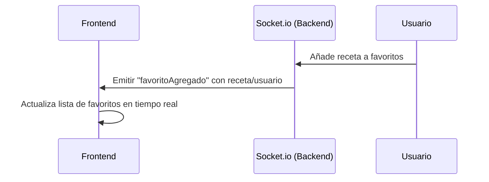
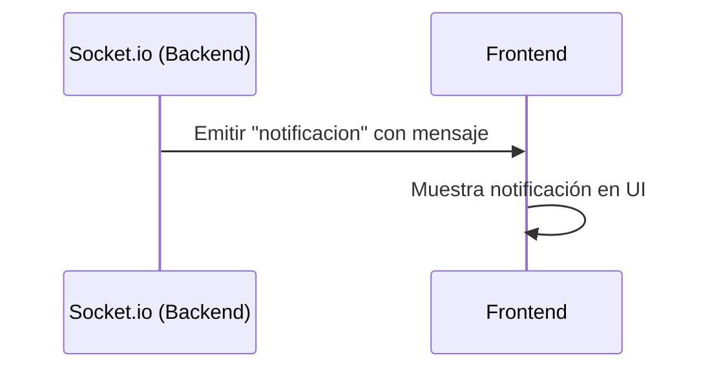

## Diagrama de arquitectura

# FitFood Backend

Backend del proyecto FitFood. API REST para gestión de recetas, usuarios, favoritos, historial, ingredientes y ratings. Incluye autenticación JWT, integración con MongoDB Atlas y Cloudinary(pendiente), Websockets, Swagger, SonarQube(por añadir), ESLint y tests con Jest.

---

## Instalación y configuración

1. Instala dependencias:
   ```
   npm install
   ```
2. Crea un archivo `.env` con las variables necesarias:
   ```
   MONGO_URI=tu_uri_de_mongodb
   JWT_SECRET=tu_secreto_jwt
   CLOUDINARY_CLOUD_NAME=tu_cloud_name
   CLOUDINARY_API_KEY=tu_api_key
   CLOUDINARY_API_SECRET=tu_api_secret
   ```
3. Ejecuta el servidor:
   ```
   npm start
   ```

---

## Estructura del proyecto

```
backend/
  src/
    app.js
    server.js
    config/
      db.js
    controllers/
      ...
    middlewares/
      ...
    models/
      ...
    routes/
      ...
    seed/
      ...
    utils/
      ...
    tests/
      ...
```


## Diagrama de arquitectura

```
flowchart TD
  Client[Cliente (Frontend)] -->|HTTP| API[Express API]
  API -->|Swagger| Docs[Swagger UI]
  API -->|Websockets| Socket[Socket.io]
  API -->|MongoDB| DB[(MongoDB Atlas)]
  API -->|Cloudinary| Cloud[Cloudinary]
  API -->|JWT| Auth[Autenticación]
```

## Flujos de Websockets

### Perfil actualizado (evento: perfilActualizado)



### Nuevo favorito añadido (evento: favoritoAgregado)


### Notificación general (evento: notificacion)



## Uso y endpoints

- Documentación Swagger disponible en `/api-docs`.
- Endpoints principales:
  - `/api/auth` (registro, login)
  - `/api/recipes` (CRUD recetas)
  - `/api/ingredients` (CRUD ingredientes)
  - `/api/favorites` (gestión favoritos)
  - `/api/history` (historial)
  - `/api/rating` (valoraciones)
  - `/api/contact` (contacto)
  - `/api/upload` (subida imágenes)
  - `/api/ai` (asistente IA)

## Testing y cobertura

- Ejecuta tests:
  ```
  npm test
  ```
- Cobertura >90% con Jest y Supertest.

## Despliegue (Render & Docker)

### Render

1. Configura variables de entorno en Render.
2. Usa la raíz del backend como directorio de despliegue.
3. MongoDB debe ser accesible desde Render.

### Docker (falta implementar)

1. Construye la imagen:
   ```bash
   docker build -t fitfood-backend .
   ```
2. Ejecuta el contenedor:
   ```bash
   docker run -p 3000:3000 --env-file .env fitfood-backend
   ```
3. Para el proyecto completo, usa `docker-compose.yml` en la raíz:
   ```bash
   docker-compose up --build
   ```

## Herramientas integradas

- ESLint (estilo y calidad)
- SonarQube (análisis estático)
- Swagger (documentación API)
- Jest & Supertest (testing)
- Socket.io (Websockets)

## Características principales

- Autenticación JWT y gestión de roles (usuario, nutricionista, admin)
- CRUD de usuarios, recetas, ingredientes, historial, favoritos y valoraciones
- Cálculo automático de calorías y macros
- Asistente IA (LM Studio/Qwen3)
- Subida de imágenes con Cloudinary
- Notificaciones en tiempo real vía Websockets (Socket.io)
- Documentación interactiva Swagger
- Validaciones de seguridad (contraseña fuerte, email válido)
- Base de datos MongoDB
- Tests unitarios y de integración (Jest, Supertest)
- Cobertura de tests >80%
- Linter ESLint y análisis SonarQube
- Arquitectura modular y escalable
- Valoraciones y comentarios en recetas

## Herramientas implementadas

- **ESLint**: Linter para mantener calidad de código (`.eslintrc.js`)
- **SonarQube**: Análisis estático y cobertura (`sonar-project.properties`)
- **Swagger**: Documentación interactiva en `/api/docs` (`src/swagger.js`)
- **Socket.io**: Websockets para notificaciones (`src/socketServer.js`)
- **Jest & Supertest**: Tests unitarios, integración y M2M (`jest.config.js`, `tests/`)
- **mongodb-memory-server**: Tests aislados en memoria
- Base de datos MongoDB

## Estructura de carpetas

```
backend/
├── src/
│   ├── app.js
│   ├── server.js
│   ├── config/
│   │   └── db.js
│   ├── controllers/
│   │   ├── aiController.js
│   │   ├── contactController.js
│   │   ├── favoriteController.js
│   │   ├── historyController.js
│   │   ├── ingredientController.js
│   │   ├── ratingController.js
│   │   ├── recipeController.js
│   │   ├── uploadController.js
│   │   └── userController.js
│   ├── middlewares/
│   │   └── authMiddleware.js
│   ├── models/
│   │   ├── Contact.js
│   │   ├── Favorite.js
│   │   ├── History.js
│   │   ├── Ingredient.js
│   │   ├── Rating.js
│   │   ├── Recipe.js
│   │   └── User.js
│   ├── routes/
│   │   ├── aiRoutes.js
│   │   ├── authRoutes.js
│   │   ├── contactRoutes.js
│   │   ├── favoriteRoutes.js
│   │   ├── historyRoutes.js
│   │   ├── ingredientRoutes.js
│   │   ├── ratingRoutes.js
│   │   ├── recipeRoutes.js
│   │   ├── uploadRoutes.js
│   │   └── userRoutes.js
│   ├── seed/
│   │   ├── ingredients.js
│   │   ├── recipes.js
│   │   └── users.js
│   ├── utils/
│   │   └── cloudinary.js
│   ├── tests/
│   │   ├── ai.test.js
│   │   ├── auth.test.js
│   │   ├── favorites.test.js
│   │   └── app.endpoints.test.js
│   ├── swagger.js
│   └── socketServer.js
├── .eslintrc.js
├── sonar-project.properties
├── jest.config.js
├── package.json
└── README.md
```

## Diagrama de arquitectura

```
graph TD
  A[Cliente (Frontend)] -- HTTP/REST --> B(Express API)
  A -- Websockets --> D(Socket.io)
  B -- MongoDB --> C[(Base de datos)]
  B -- Cloudinary --> E[(Imágenes)]
  B -- LM Studio --> F[(IA)]
  B -- Swagger --> G[(Docs)]
```

- Validaciones de seguridad (contraseña fuerte, email válido)
- Asistente IA con LM Studio (Qwen3)

### 4. Ejecutar el servidor

**Modo desarrollo (con nodemon):**

```
npm run dev
```

**Modo producción:**

```
npm start
```

El servidor estará disponible en `http://localhost:5000`

## Endpoints Principales

### Autenticación

| Método | Endpoint | Descripción |
|--------|----------|-------------|
| POST | `/api/auth/registro` | Registrar nuevo usuario |
| POST | `/api/auth/login` | Iniciar sesión |
| GET | `/api/auth/verificar` | Verificar token (requiere auth) |

**Ejemplo de registro:**

```
{
  "usuario": "victor_98",
  "email": "victor@example.com",
  "nombre": "Víctor",
  "apellidos": "Ridao Chaves",
  "contrasena": "Admin123!",
  "rol": "usuario"
}
```

**Respuesta:**

```
{
  "mensaje": "Usuario registrado exitosamente",
  "token": "eyJhbGciOiJIUzI1NiIsInR5cCI6IkpXVCJ9...",
  "usuario": {
    "id": "...",
    "usuario": "victor_98",
    "email": "victor@example.com",
    "nombre": "Víctor",
    "rol": "usuario"
  }
}
```

### Recetas

| Método | Endpoint | Descripción |
|--------|----------|-------------|
| POST | `/api/recetas` | Crear receta (requiere auth) |
| GET | `/api/recetas` | Obtener todas las recetas |
| GET | `/api/recetas/:id` | Obtener detalle de receta |
| GET | `/api/recetas/usuario/:usuarioId` | Obtener recetas de un usuario |
| PUT | `/api/recetas/:id` | Actualizar receta (requiere auth) |
| DELETE | `/api/recetas/:id` | Eliminar receta (requiere auth) |

**Ejemplo de crear receta:**

```
{
  "nombre": "Ensalada César",
  "descripcionCorta": "Ensalada fresca con pollo y aderezo César",
  "descripcionLarga": "Una deliciosa ensalada con lechuga romana, pollo a la parrilla...",
  "dificultad": "facil",
  "categoria": "almuerzo",
  "tiempoPreparacion": 15,
  "ingredientes": [
    {
      "ingrediente": "507f1f77bcf86cd799439011",
      "cantidad": 200
    }
  ]
}
```

### Favoritos

| Método | Endpoint | Descripción |
|--------|----------|-------------|
| POST | `/api/favoritos` | Agregar a favoritos (requiere auth) |
| GET | `/api/favoritos` | Obtener mis favoritos (requiere auth) |
| DELETE | `/api/favoritos/:recetaId` | Eliminar de favoritos (requiere auth) |

### Valoraciones

| Método | Endpoint | Descripción |
|--------|----------|-------------|
| POST | `/api/valoraciones` | Valorar receta (requiere auth) |
| GET | `/api/valoraciones/:recetaId` | Obtener valoraciones de una receta |
| GET | `/api/valoraciones/:recetaId/usuario` | Mi valoración (requiere auth) |
| PUT | `/api/valoraciones/:id` | Actualizar valoración (requiere auth) |
| DELETE | `/api/valoraciones/:id` | Eliminar valoración (requiere auth) |

### IA

| Método | Endpoint | Descripción |
|--------|----------|-------------|
| POST | `/api/ai/chat` | Asistente IA (requiere auth) |

**Ejemplo de valoración:**

```
{
  "recetaId": "507f1f77bcf86cd799439011",
  "puntuacion": 5,
  "comentario": "¡Excelente receta, muy fácil de hacer!"
}
```
| Método | Endpoint | Descripción |
|--------|----------|-------------|
| POST | `/api/historial` | Crear/actualizar historial (requiere auth) |
| GET | `/api/historial` | Obtener historial de una fecha (requiere auth) |

### Autenticación

- Se utiliza **JWT** para la autenticación
- El token se envía en el header: `Authorization: Bearer <token>`
- Token válido por 7 días
Requisitos de contraseña fuerte:
- Mínimo 8 caracteres
- Incluir mayúscula (A-Z)
- Incluir minúscula (a-z)
- Incluir número (0-9)
- Incluir carácter especial (@$!%*?&)

**Ejemplo válido:** `Admin123!`

### Roles

- **usuario**: Usuario estándar
- **nutricionista**: Puede crear recetas oficiales
- **admin**: Acceso total al sistema

## Modelos de Datos

### Usuario

```
{
  usuario: String (unique),
  email: String (unique),
  nombre: String,
  apellidos: String,
  contrasena: String (hasheada),
  foto: String,
  biografia: String,
  rol: 'usuario' | 'nutricionista' | 'admin',
  activo: Boolean,
  timestamps
}
```

### Recetas

```
{
  nombre: String,
  autor: ObjectId (ref User),
  descripcionCorta: String,
  descripcionLarga: String,
  dificultad: 'facil' | 'medio' | 'dificil',
  imagen: String,
  ingredientes: [{
    ingrediente: ObjectId (ref Ingredient),
    cantidad: Number
  }],
  categoria: 'desayuno' | 'almuerzo' | 'cena' | 'snack' | 'postre',
  tiempoPreparacion: Number,
  calorias: Number (auto),
  proteinas: Number (auto),
  grasas: Number (auto),
  carbohidratos: Number (auto),
  esOficial: Boolean,
  puntuacionPromedio: Number,
  totalValorations: Number,
  timestamps
}
```

### Ingredientes

```
{
  nombre: String (unique),
  calorias: Number (por 100g),
  unidad: 'g' | 'ml' | 'unidad',
  proteinas: Number,
  grasas: Number,
  carbohidratos: Number,
  descripcion: String,
  timestamps
}
```

### Favoritos

```
{
  usuario: ObjectId (ref User),
  receta: ObjectId (ref Recipe),
  timestamps
}
```

### Rating

```
{
  usuario: ObjectId (ref User),
  receta: ObjectId (ref Recipe),
  puntuacion: Number (1-5),
  comentario: String,
  timestamps
}
```

### History

```
{
  usuario: ObjectId (ref User),
  fecha: Date,
  alimentos: [{
    receta: ObjectId (ref Recipe),
    ingrediente: ObjectId (ref Ingredient),
    cantidad: Number,
    calorias: Number,
    hora: String
  }],
  totalCalorias: Number (auto),
  totalProteinas: Number (auto),
  totalGrasas: Number (auto),
  totalCarbohidratos: Number (auto),
  timestamps
}
```

## Dependencias

- **express**: Framework web
- **mongoose**: ODM para MongoDB
- **bcryptjs**: Encriptación de contraseñas
- **jsonwebtoken**: Autenticación JWT
- **cors**: Control de CORS
- **dotenv**: Variables de entorno
- **validator**: Validación de datos
- **cloudinary**: Almacenamiento de imágenes
- **multer**: Carga de archivos
- **express-async-errors**: Manejo de errores async/await

## Tests

```
npm test
```

## Notas

- Las calorías se calculan automáticamente basándose en los ingredientes
- Solo un usuario puede tener un historial por fecha
- Un usuario solo puede valorar una receta una vez
- Las contraseñas se encriptan con bcryptjs
- CORS configurado solo desde Vercel en producción

# Por añadir

implementar modelo mensajes

eliminar contact.js

añadir mas parámetros a las categorías (bebidas, almuerzos, etc)

evitar que el usaurio pueda borrarse a si mismo y que no se puedan eliminar entre ellos

cambiar actualizar perfil del usuario ()

añadir cloudinari

falta Docker

añadir mailhog (si se puede)

añadir correo electrónico

coolify (montarte tu propio render)

hedsnet
