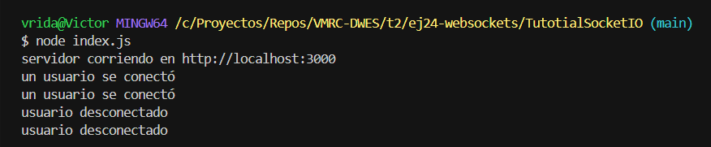

# Conexión localhost mediante WebSockets

url: https://socket.io/es/

---

## Configuración básica del proyecto

El objetivo es crear una aplicación de chat sencilla usando Node.js, Express y Socket.IO.

Primero se crea un archivo `package.json` para definir el proyecto y sus dependencias. Luego se instala Express con `npm install express` y se configura un servidor básico en `index.js` que responde en `http://localhost:3000`.

```
{
  "name": "tutotialsocket",
  "version": "0.0.1",
  "description": "Prueba para socket.io",
  "type": "module",
  "dependencies": {
    "express": "^4.22.1",
    "socket.io": "^4.8.3"
  }
}

```

## Servir contenido HTML

En lugar de enviar HTML directamente desde el servidor, se crea un archivo `index.html` que contiene un formulario y una lista de mensajes. Este archivo se sirve utilizando `res.sendFile()`.

```
<!DOCTYPE html>
<html>

<head>
    <meta name="viewport" content="width=device-width,initial-scale=1.0">
    <title>Chat Socket.IO</title>
    <style>
        body {
            margin: 0;
            padding-bottom: 3rem;
            font-family: -apple-system, BlinkMacSystemFont, "Segoe UI", Roboto, Helvetica, Arial, sans-serif;
        }

        #form {
            background: rgba(0, 0, 0, 0.15);
            padding: 0.25rem;
            position: fixed;
            bottom: 0;
            left: 0;
            right: 0;
            display: flex;
            height: 3rem;
            box-sizing: border-box;
            backdrop-filter: blur(10px);
        }

        #input {
            border: none;
            padding: 0 1rem;
            flex-grow: 1;
            border-radius: 2rem;
            margin: 0.25rem;
        }

        #input:focus {
            outline: none;
        }

        #form>button {
            background: #333;
            border: none;
            padding: 0 1rem;
            margin: 0.25rem;
            border-radius: 3px;
            outline: none;
            color: #fff;
        }

        #messages {
            list-style-type: none;
            margin: 0;
            padding: 0;
        }

        #messages>li {
            padding: 0.5rem 1rem;
        }

        #messages>li:nth-child(odd) {
            background: #efefef;
        }
    </style>
</head>

<body>
    <ul id="messages"></ul>
    <form id="form" action="">
        <input id="input" autocomplete="off" /><button>Enviar</button>
    </form>
    <script src="/socket.io/socket.io.js"></script>
    <script>
        var socket = io();

        var form = document.getElementById('form');
        var input = document.getElementById('input');
        var messages = document.getElementById('messages');

        form.addEventListener('submit', function (e) {
            e.preventDefault();
            if (input.value) {
                socket.emit('chat message', input.value);
                input.value = '';
            }
        });

        socket.on('chat message', function (msg) {
            var item = document.createElement('li');
            item.textContent = msg;
            messages.appendChild(item);
            window.scrollTo(0, document.body.scrollHeight);
        });
    </script>
</body>

</html>
```

## Integración de Socket.IO

Se instala Socket.IO (`npm install socket.io`) y se integra con el servidor HTTP. Esto permite manejar conexiones en tiempo real entre cliente y servidor mediante eventos como `connection` y `disconnect`.

```
import express from 'express';
import { createServer } from 'node:http';
import { fileURLToPath } from 'node:url';
import { dirname, join } from 'node:path';
import { Server } from 'socket.io';

const app = express();
const server = createServer(app);
const io = new Server(server);

const __dirname = dirname(fileURLToPath(import.meta.url));

app.get('/', (req, res) => {
    res.sendFile(join(__dirname, 'index.html'));
});

io.on('connection', (socket) => {
    console.log('un usuario se conectó');
    socket.on('disconnect', () => {
        console.log('usuario desconectado');
    });
});

io.on('connection', (socket) => {
    socket.on('chat message', (msg) => {
        io.emit('chat message', msg);
    });
});

// Mensaje de prueba para todos los usuarios que se conecten
io.emit('hello', 'world');

server.listen(3000, () => {
    console.log('servidor corriendo en http://localhost:3000');
});
```

## Envío y recepción de mensajes

Cuando el usuario envía un mensaje desde el formulario, se emite un evento (`chat message`) al servidor. El servidor recibe este evento y puede procesarlo.

### Imagen con el servidor conectado y mostrando conexión y desconexión de usuarios



## Comunicación en tiempo real (broadcast)

El servidor retransmite los mensajes a todos los clientes conectados usando `io.emit()`. En el cliente, los mensajes recibidos se añaden dinámicamente a la lista en la página, creando un chat en tiempo real funcional.

### GIF con el recorrido desde arrancar el server hasta mostrar mensajes entre usuarios


